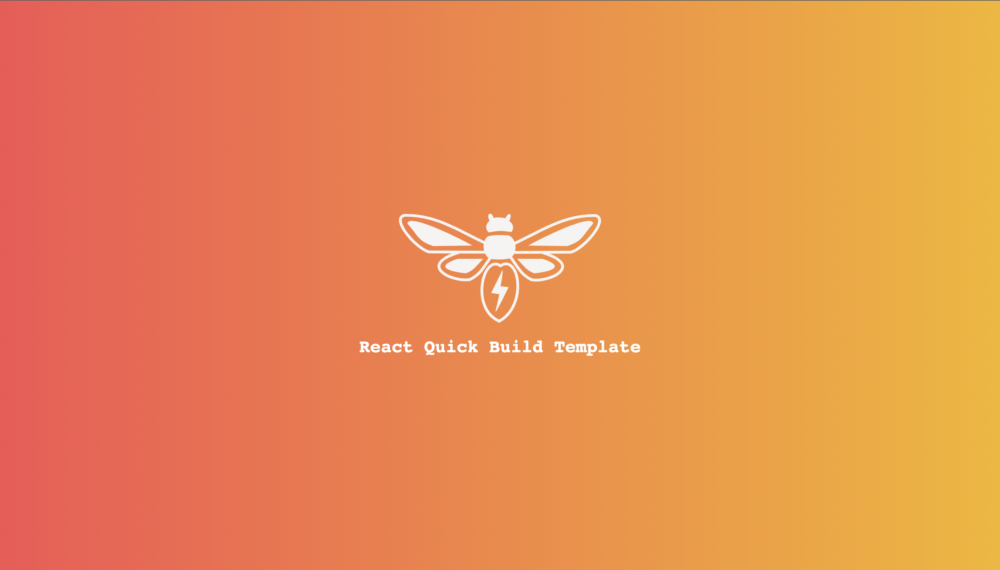

 
 <h1 align="center"> React ESBuild Template </h1>

A Template repository with build scripts to bundle and build React applications quickly with the fast `esbuild` bundler.
If you are tired of the slow build times of `webpack` and not yet ready to embrace `vite`, then this could be a quick alternative for your small to mid-sized react projects.

 

    

### Supports
- CSS Modules
- SVG imports as React Components
- Tree shaking

### Built With
- esbuild
- BASH
- React

